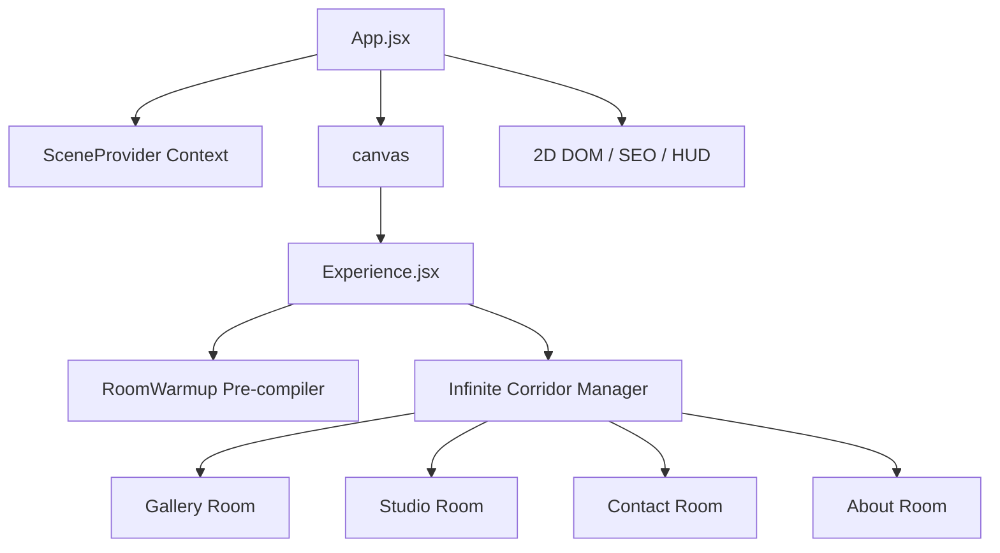

# 🎨 Ayush Patel | Interactive 3D WebGL Portfolio

<div align="center">
  
  
  
  
  
</div>

<br/>

Welcome to the official repository of **Ayush Patel's** interactive 3D Web Developer & Automation Robotics portfolio. This project features spatial WebGL computing, complex React ecosystems, and high-performance interactive 3D environments presenting hardware projects, robotics builds, software systems, and event coordination milestones.

> [!NOTE]
> Ensure hardware acceleration is enabled in your browser settings for smooth 60 FPS rendering.

## 🚀 Features & Architecture

- **3D Corridor Navigation**: Interactive room transitions (Gallery, Studio, Contact, About).
- **Physical Robotics Builds**: Displaying AI Autonomous Driving Robot, Hand Gesture Car, Mapping Robot Car, and Stretch Wrapping Robot.
- **Software Systems**: Featuring Passenger Attendance System, FinNexa AI, GitProfile Studio, and Group Walkie.
- **Asynchronous Shader Compilation**: Built-in preloader and warmup system for seamless texture rendering.
- **Cross-Platform Responsive Layout**: Tailored WebGL resolution scaling and UI adaptivity.

---

## 🏗️ 3D Scene Architecture



---

## 🛠️ Local Development Setup

To run this application natively on your local machine:

1. **Clone the repository:**
   ```bash
   git clone https://github.com/ayushpatel2007/portfolio.git
   cd portfolio
   ```

2. **Install dependencies:**
   Make sure you are on Node.js v20+.
   ```bash
   npm install
   ```

3. **Start the local Dev Server:**
   ```bash
   npm run dev
   ```

4. **Build for production:**
   ```bash
   npm run build
   ```

---

## 📄 Contact & Links

- **LinkedIn**: [https://www.linkedin.com/in/ayushpatel2037/](https://www.linkedin.com/in/ayushpatel2037/)
- **GitHub**: [https://github.com/ayushpatel2007](https://github.com/ayushpatel2007)
- **Email**: patelayush20@outlook.com

---

*Designed and Developed by Ayush Patel.*
